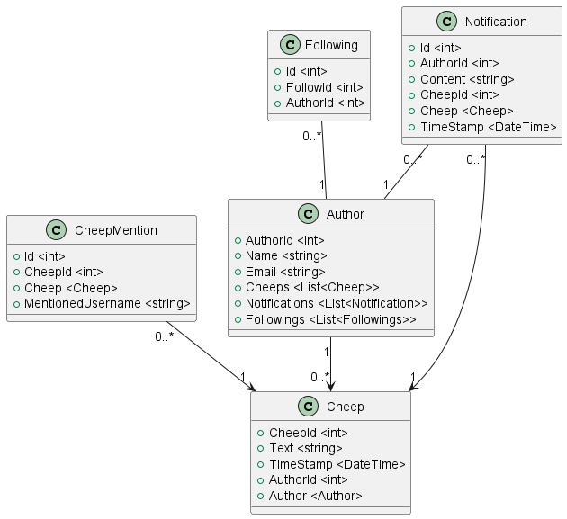
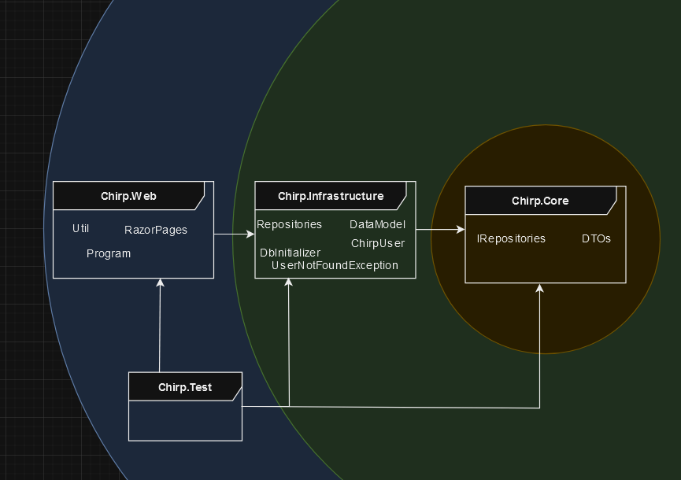
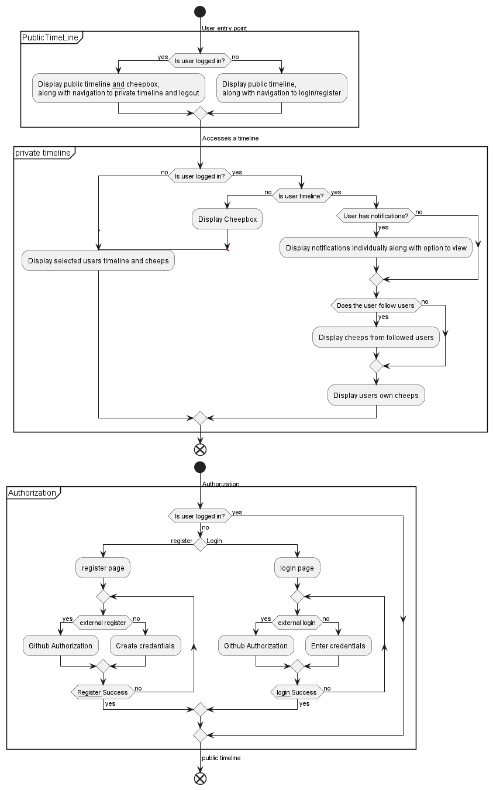
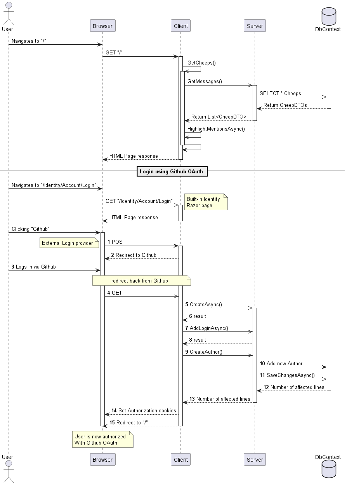
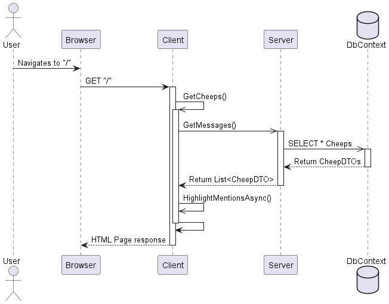
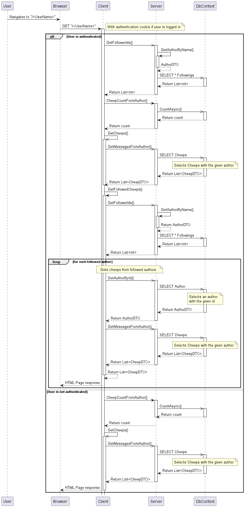
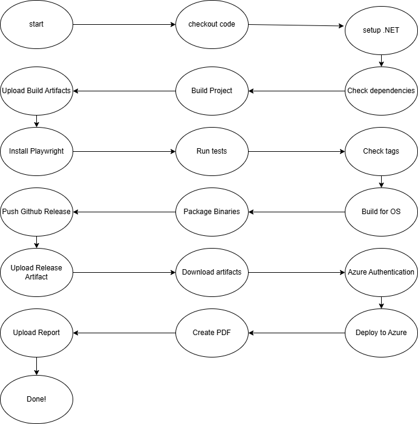
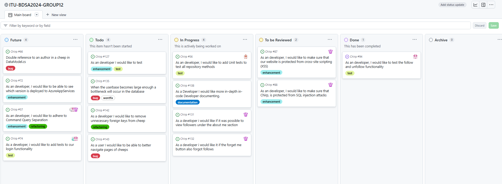
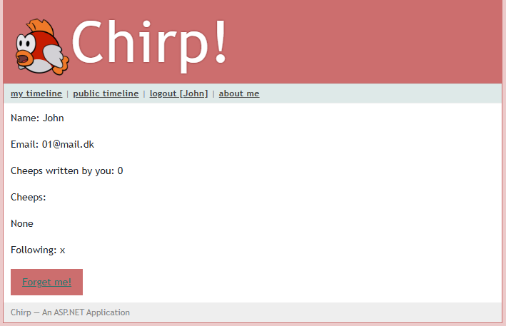

## Design and Architecture of _Chirp!_

### Domain model

The domain model of _Chirp!_ describes the conceptual design of the application, and visualize how the different entities interacts in the application.

A UML Class diagram of our Domain model.



### Architecture — In the small

_Chirp!_ has been developed using the Onion architecture, which splits the project into 3 distinct layers:

* Domain layer
* Repository layer
* UI layer

Organizing the project this way, helps to control the flow of dependencies using Inversion of Control (or dependency injection).[^1]

This leads to better testability and maintainability.[^2]

Onion architecture of _Chirp!_



[^1]: <https://github.com/itu-bdsa/lecture_notes/blob/main/sessions/session_07/Slides.md>
[^2]: <https://www.codeguru.com/csharp/understanding-onion-architecture/>

### Architecture of deployed application

_Chirp!_ application is designed to work as a ASP.NET Core Razor Pages web app, which utilizes an SQLite database in the backend.

Clients interacts with _Chirp!_ through an web browser of the users choice.

_Chirp!_ is meant to be deployed to an Platform-as-a-Service (PaaS) like Azure App Service, which will run and host the _Chirp!_ application. [^5]

Client and server components in a UML Deployment diagram


[^5]: <https://github.com/itu-bdsa/lecture_notes/blob/main/sessions/session_04/Slides.md>

### User activities

Activity diagram over user activities



### Sequence of functionality/calls trough _Chirp!_¨

Sequence diagrams for authorized and non Authorized users, and private timeline.





## Process

### Build, test, release, and deployment



 The workflow for the Chirp! application follows a structured pipeline that includes building, testing, releasing, and deploying the application. the individual steps are as follows:

1. The build process is triggered by events such as pushes and pull_requests. First the code is fetched from the repository using actions/checkout. The required .NET environment (version 7.0) is configured. Dependencies are restored to ensure all packages are available. The application is compiled using dotnet build or dotnet publish. The compiled output (e.g., binaries) is stored as an artifact for further use.
2. The test job  installs playwright dependencies: For UI testing, browser dependencies are also installed. Unit and integration tests are executed using dotnet test with Playwright setup. Test results determine if the pipeline proceeds to the next steps.
3. A GitHub Release is created when a new tag is pushed.  The application is built for multiple platforms (Linux, Windows, macOS) using `dotnet publish`. Each build is packaged into `.zip` archives. A versioned release entry is created on github and the packaged binaries are attached to the GitHub Release, making them available for download.
4. Deployment to Azure Web App occurs after a successful build. The previously uploaded build artifacts are retrieved and secure login to Azure is established. The application is then deployed to the production environment.

### Team work

At the current time in our development of _Chirp!_, all the wanted features are implemented in the application,
but not all of them are working completely as intended and we have run into some bugs and issues that currently remain unfixed.
Some examples of this is our private timeline is displaying cheeps in an order that is not chronological.
If you go to the next page on any timeline and there is no more cheeps to display, you get sent to an empty page with no option to go back.
There is also some refactoring we would like to get done to remove unnecessary references and foreign keys in different places,
we thought we needed these at a point in development and didn't get to put in the time to go back and clean it up.
Below is a picture of our current project board that shows all of the issues we did not finish at the current time.  



Whenever a new issue was created in our project, we would assign it to one of multiple people.
These people would be tasked with handling and solving this issue, to do this we would create a new branch from main for them to work on said issue.
Whenever this issue was solved in the branch, a pull request would be sent to main and a merge would be attempted, this pull request would require at least one review from another member of the group.
The pull request would need to pass a build test, and pass all of our own written tests and finally get recommended code changes through Code Factor, and merge conflicts would have to be solved by the group member that sent the pull request.
Once all of this has been sorted, the branch would be merged with main and would no longer be in use, if another issue were to be made that revolved around the same feature a separate branch would be created from main to solve the new issue.


### How to make _Chirp!_ work locally

To make _Chirp!_ work locally, you have to first have to install prerequisites

* .NET 7 SDK
* git
* pwsh

 clone the repository

```bash
git clone https://github.com/ITU-BDSA2024-GROUP12/Chirp.git
```

Change directory to `Chirp.Web`

```bash
cd Chirp/src/Chirp.Web
```

Add user secrets by executing:

```bash
dotnet user-secrets init
dotnet user-secrets set "authentication_github_clientId" "Ov23liDE0T7SBaQRUByB"
dotnet user-secrets set "authentication_github_clientSecret" "0c6877a3701918d0def7b409dac6efd53b5b15f3"
```

(These secrets have been generated specifically for use in the exam)

.NET Core SDK includes an HTTPS development certificate,
to install the ASP.NET Core HTTPS development certificate to the local user certificate store, use the following command:

```bash
dotnet dev-certs https --trust
```

Start the application with `dotnet run`

```bash
dotnet run
```

Your application should start listening on two ports, you should open the `https` one. which, if not changed directly should be localhost port 7102 `https://localhost:7102`

GitHub OAuth has been configured to the Chirp! application running on <https://localhost:7102/>

### How to run test suite locally

**Description of test**


To test the application locally, first change director back to root

```bash
cd ../../
```

You should now be in `C:/YOURPC/SOMEWHERE/Chirp`

if playwright is not installed, you should install it with

```bash
pwsh test/Chirp.UI.Tests/bin/Debug/net7.0/playwright.ps1 install --with-deps
```

(OBS. since the application uses dotnet 7, newer versions of powershell might be incompatible)

You can now test the whole project with `dotnet test`

```bash
dotnet test
```

## Ethics

The _Chirp!_ application makes it possible for users to login using a third-party OAuth provider (Github OAuth), or register with a C# Identity account. [^3]

By signing up for an account, the user is providing their email and a username, therefore _Chirp!_ has to comply with General Data Protection Regulation (GDPR) [^4]

_Chirp!_ in its current state does not meet all requirements, fx. the user accounts is stored in a non-encrypted sqlite database file (passwords is obfuscated by hashing).

It is possible for the user to delete their account by using the _Forget me!_ button



This will delete all information about the user from the _Chirp!_ system including any mentions and cheeps written by the user.

[^3]: <https://learn.microsoft.com/en-us/aspnet/core/security/authentication/identity?view=aspnetcore-7.0&tabs=visual-studio>
[^4]: <https://gdpr-info.eu/>

## License
We chose the MIT License for our project since it is highly permissive, allowing users to modify and distribute it freely as long as proper attribution is done, thus making it easier for other to integrate our code into their own projects. It is also compatible with many other open-source licenses.

## LLMs, ChatGPT, CoPilot, and others

During the development of _Chirp!_, we used LLMs for debugging code, warnings and making functional regex's.  
Some of the responses were quite helpful, and worked. While others did not work continued to not work, for example, if a prompt was in a wrong direction, correctness wise, the LLMs would not catch that, and try to solve an if not already unsolvable, then just a wrong answer to a problem.

Even though some of the prompts did not yield the correct response/result, some of the reasoning the LLMs gave, would make the development better in the lager stages.

Other LLMs like build in intellisense, with code completions has also been used, to speed up typing. This did also come with downsides, such as it obscuring the intended completion with other, and sometimes wrong code.

The LLMs summed up, sped up our work, by a small factor.
