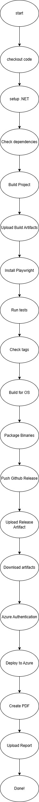

# Design and Architecture of _Chirp!_

## Domain model

A UML Class diagran of our Domain model. 


## Architecture — In the small

Onion diagram of Project architecture 


## Architecture of deployed application

Client and server components in a client-server diagram


## User activities

Activity diagram over user activities


## Sequence of functionality/calls trough _Chirp!_¨

Sequence diagrams for authorized and non Authorized users, and private timeline 


# Process

## Build, test, release, and deployment

**måske bedre billede**

Flowchart over workflow



## Team work
At the current time in our development of _Chirp!_, all the wanted features are implemented in the application, 
but not all of them are working completely as intended and we have run into some bugs and issues that currently remain unfixed. 
Some examples of this is our private timeline is displaying cheeps in an order that isnt chronological. 
If you go to the next page on any timeline and there is no more cheeps to display, you get sent to an empty page with no option to go back. 
There is also some refactoring we would like to get done to remove unnecessary references and foreign keys in different places, 
we thought we needed these at a point in development and didn't get to put in the time to go back and clean it up. 
Below is a picture of our current project board that shows all of the issues we didnt finish at the current time.  


Whenever a new issue was created in our project, we would assign it to one of multiple people. 
These people would be tasked with handling and solving this issue, to do this we would create a new branch from main for them to work on said issue.
Whenever this issue was solved in the branch, a pull request would be sent to main and a merge would be attempted, this pull request would require at least one review from another member of the group.
The pull request would need to pass a build test, and pass all of our own written tests and finally get recommended code changes through Code Factor, and merge conflicts would have to be solved by the group member that sent the pull request.
Once all of this has been sorted, the branch would be merged with main and would no longer be in use, if another issue were to be made that revolved around the same feature a seperate branch would be created from main to solve the new issue.

**new diagram from mathias**


## How to make _Chirp!_ work locally
To make _Chirp!_ work locally, you have to first have to install prerequisites

- .NET 7 SDK
- git
- pwsh


 clone the repository

```bash
git clone https://github.com/ITU-BDSA2024-GROUP12/Chirp.git
```

Change directory to `Chirp.Web`
```bash
cd Chirp/src/Chirp.Web
```

Add user secrets by typing:
```bash
dotnet user-secrets init
dotnet user-secrets set "authentication_github_clientId" "Ov23liDE0T7SBaQRUByB"
dotnet user-secrets set "authentication_github_clientSecret" "0c6877a3701918d0def7b409dac6efd53b5b15f3"
```

(These secrets have been generated specifically for use in the exam)

.NET Core SDK includes an HTTPS development certificate,
to install the ASP.NET Core HTTPS development certificate to the local user certificate store, use the following command:

```bash
dotnet dev-certs https --trust
```

Start the application with `dotnet run`

```bash
dotnet run
```

Your application should start listening on two ports, you should open the `https` one. which, if not changed directly should be localhost port 7102 `https://localhost:7102`

GitHub OAuth has been configured to the Chirp! application running on <https://localhost:7102/>

## How to run test suite locally

To test the application locally, first change director back to root
```bash
cd ../../
```
You should now be in `C:/YOURPC/SOMEWHERE/Chirp`

if playwright is not installed, you should install it with
```bash
pwsh test/Chirp.UI.Tests/bin/Debug/net7.0/playwright.ps1 install --with-deps
```

(OBS. since the application uses dotnet 7, newer versions of powershell might be incompatible)

You can now test the whole project with `dotnet test`
```bash
dotnet test
```


# Ethics

## License
The MIT License

## LLMs, ChatGPT, CoPilot, and others
During the development of _Chirp!_, we used LLMs for debugging code, warnings and making functional regex's.  
Some of the reponses were quite helpful, and worked. While others did not work continued to not work, for example, if a promt was in a wrong direction, correctness wise, the LLMs would not catch that, and try to solve an if not already unsolvable, then just a wrong answer to a problem.


Even though some of the promts did not yield the correct response/result, some of the reasonings the LLMs gave, would make the development better in the lager stages.

Other LLMs like build in intellisense, with codecompletions has also been used, to speed up typing. This did also come with downsides, such as it opscuring the intended completion with other, and sometimes wrong code.

The LLMs summed up, sped up our work, by a small factor.