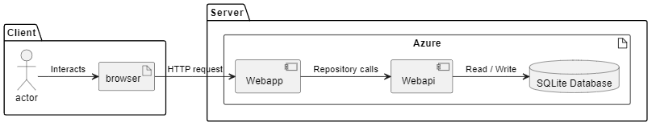

# Design and Architecture of _Chirp!_

## Domain model

Here comes a description of our domain model.

## Architecture — In the small

## Architecture of deployed application

## User activities

## Sequence of functionality/calls trough _Chirp!_

# Process

## Build, test, release, and deployment

## Team work

## How to make _Chirp!_ work locally

## How to run test suite locally

# Ethics

## License
The MIT License

## LLMs, ChatGPT, CoPilot, and others
During the development of _Chirp!_, we used LLMs for debugging code, warnings and making functional regex's.  
Some of the reponses were quite helpful, and worked. While others did not work continued to not work, for example, if a promt was in a wrong direction, correctness wise, the LLMs would not catch that, and try to solve an if not already unsolvable, then just a wrong answer to a problem.

Even though some of the promts did not yield the correct response/result, some of the reasonings the LLMs gave, would make the development better in the lager stages.

Other LLMs like build in intellisense, with codecompletions has also been used, to speed up typing. This did also come with downsides, such as it opscuring the intended completion with other, and sometimes wrong code.

The LLMs summed up, sped up our work, by **some** factor.